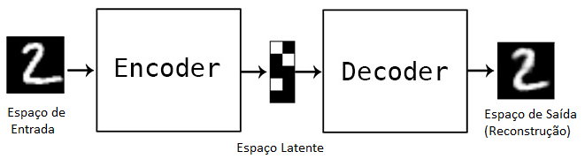
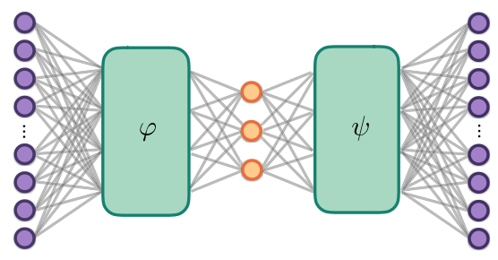

# Notas AutoEncoders

Fontes:
- Brunton - Data-Driven Science and Engineeging;
- [IntroDeepLearning](http://introtodeeplearning.com/) - Aulas de aprendizagem produnda do MIT;
- [Tutorial ](https://blog.keras.io/building-autoencoders-in-keras.html) do blog Keras;

Conteúdo:
- Conceitos
- Formulaçao matemática;
- AutoEncoder com uma camada;
- AutoEncoder esparso;
- AutoEncoder profundo (deep) totalmente conectado;
- AutoEncoder convolucional profundo;
- AutoEncoder sequencia-para-sequencia;
- AutoEncoder variacional;

---
# AutoEncoder - Conceito:

Aprendizagem não-supervisionada para redução não-linear de dimensionalidade;

- AutoEncoder generaliza SVD (linear);

<p align="center">
  
</p>

Encoder e decoder: Mapeamentos _não-lineares_ (RNA):

 - $\mathbf{x}_i \in \mathbb{R}^n$ - Dados do espaço de entrada $\mathbf{X}$ (alta dimensão);
 - $\mathbf{z}_i \in \mathbb{R}^r$ - Dados do _espaço latente_  $\mathbf{Z}$ (baixa dimensão);
 - $\hat{\mathbf{x}}_i \in \mathbb{R}^n$ - Dados do espaço de saída $\hat{\mathbf{X}}$ (alta dimensão);


---
# AutoEncoder: Fundamentação matemática

$$ \mathbf{Z} = \varphi(\mathbf{X})\hspace{2cm} \hat{\mathbf{X}} = \psi(\mathbf{Z}) $$

<p align="center">
  
</p>


$$ f_{\theta}(\mathbf{x}) = \psi(\varphi(x)) = (\psi\circ\varphi)x$$

$$\mathrm{arg_{\theta}min} \;\;\lVert\mathbf{X} - \hat{\mathbf{X}}\rVert_2 = \mathrm{arg_{\theta}min} \;\;\lVert\mathbf{X} - f_{\theta}(\mathbf{X})\rVert_2$$

$$\mathrm{arg_{\theta}min} \;\;||\mathbf{X} - (\psi\circ\varphi)x||_2$$

---

# AutoEncoder - Camada Única

Codigo Keras:

```{python, echo = TRUE, eval = FALSE, warning=FALSE, message=FALSE}
import keras
from keras import layers

x_dim = 784 # Dimensão da entrada (x)
z_dim = 32  # Dimensão da representação (z)

# Camada de entrada:
x = keras.Input(shape=(x_dim,))

# Rede Encoder:
z = layers.Dense(z_dim, activation='relu')(x)

# Rede Decoder:
y = layers.Dense(x_dim, activation='sigmoid')(z)
```


---

# Modelos Encoder e Decoder

Modelo do autoencoder: $(\psi\circ\varphi)(\mathbf{x})$ - - Mapeia a entrada para a sua reconstrução:

```{python, echo = TRUE, eval = FALSE, warning=FALSE, message=FALSE}
AutoEncoder = keras.Model(x, y)
```

Modelo do Encoder: $\mathbf{z} = \varphi(\mathbf{x})$
```{python, echo = TRUE, eval = FALSE, warning=FALSE, message=FALSE}
Encoder = keras.Model(x, z)
```

Modelo do Decoder: $y = \hat{\mathbf{x}} = \varphi(\mathbf{x})$
```{python, echo = TRUE, eval = FALSE, warning=FALSE, message=FALSE}
# Entrada com dimensão r
z = keras.Input(shape=(r,))
# Última camada do modelo AutoEncoder
decoder_layer = AutoEncoder.layers[-1]
# Cria modelo decoder
Decoder = keras.Model(encoded_input, decoder_layer(encoded_input))
```

---

# Configura modelo AutoEncoder:

```{python, echo = TRUE, eval = FALSE, warning=FALSE, message=FALSE}
autoencoder.compile(optimizer = 'adam', 
                         loss = 'binary_crossentropy')
```


---
class: title-slide-final, middle


---